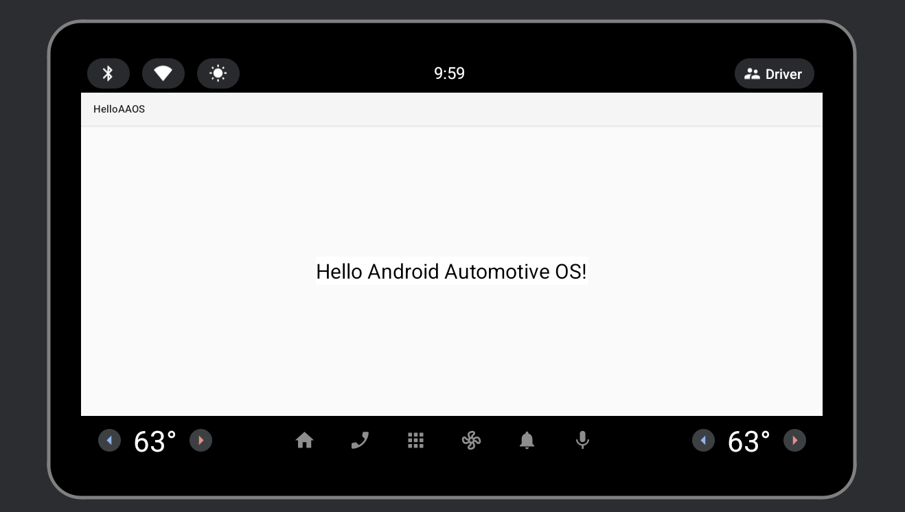
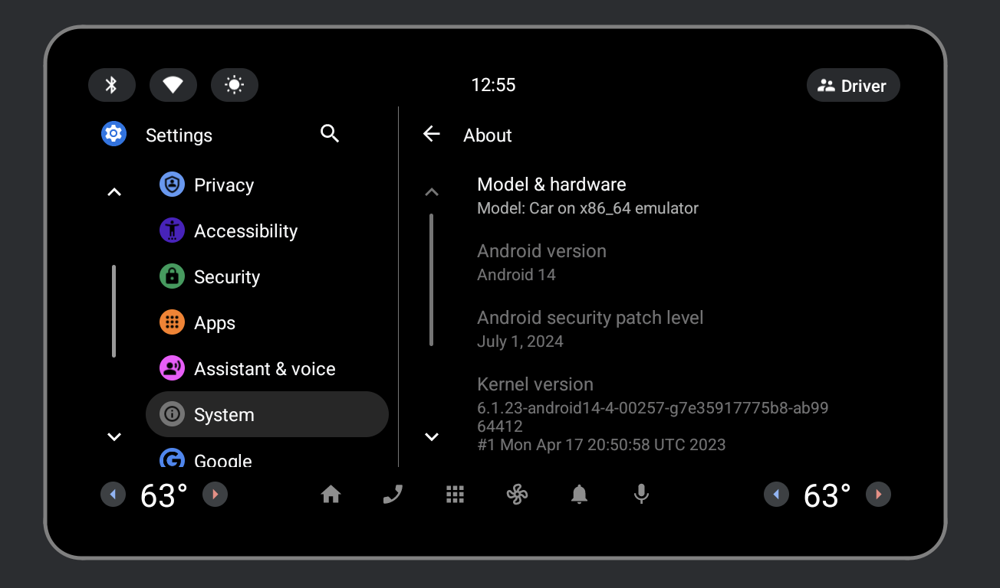
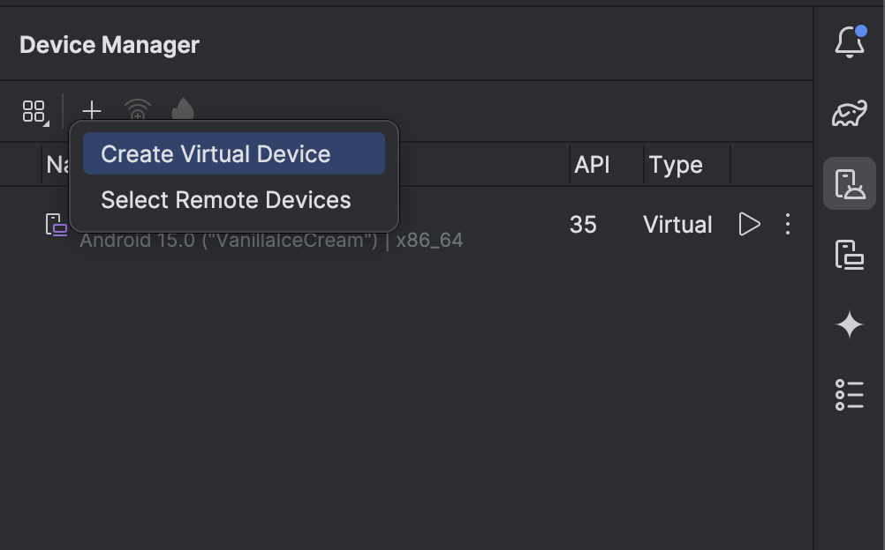
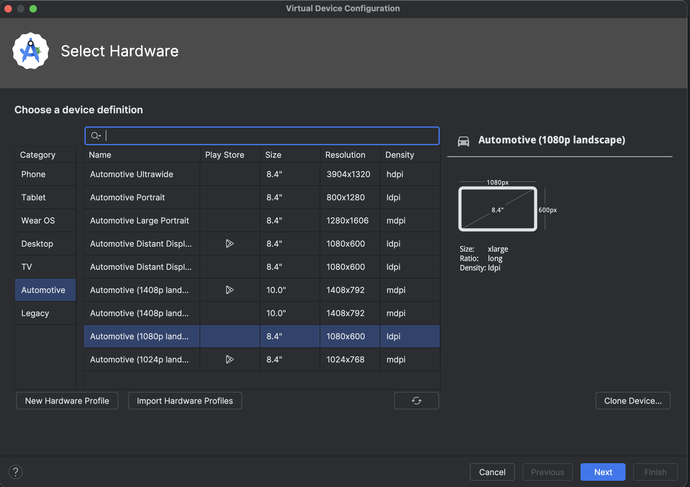
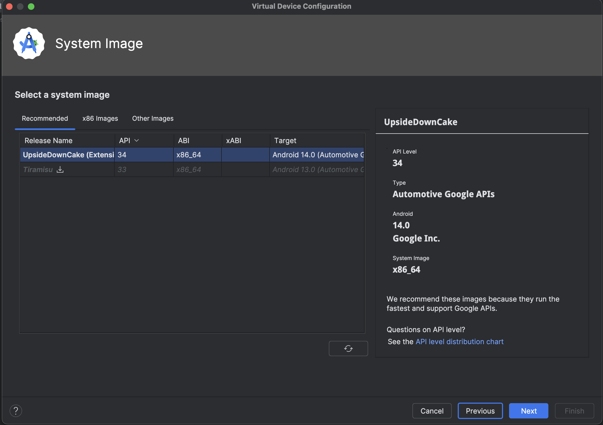
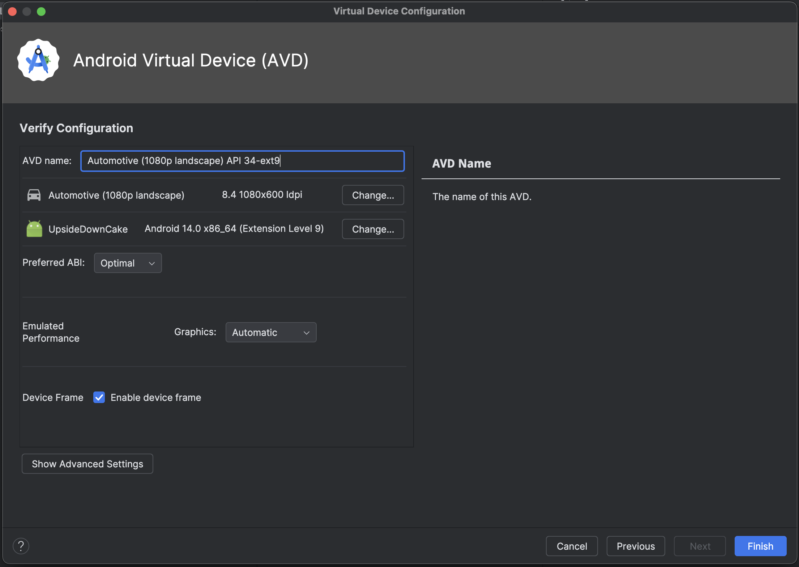
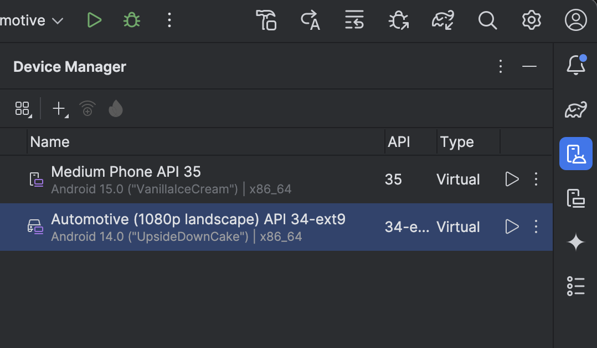
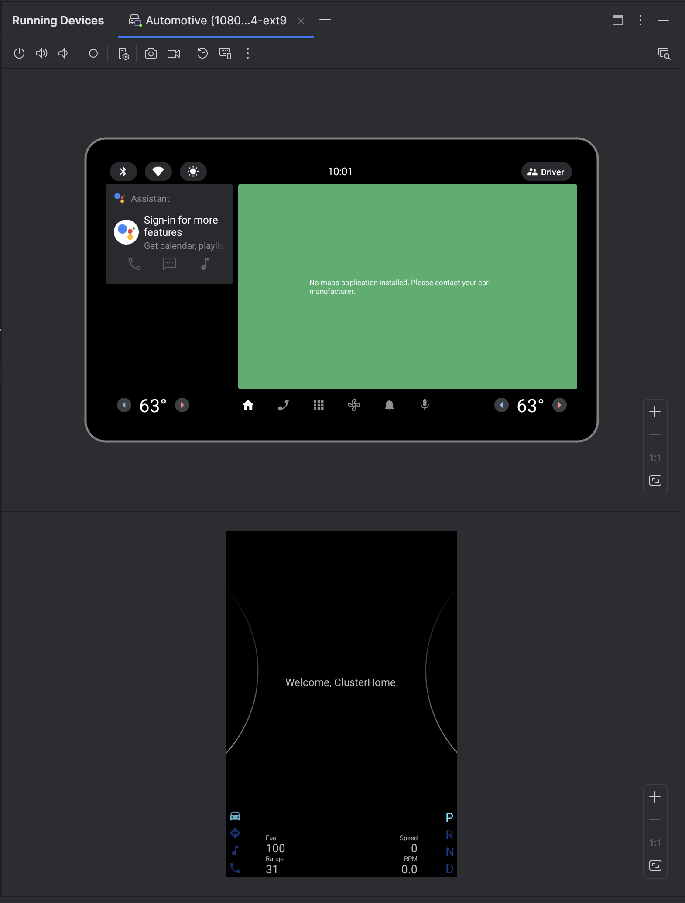
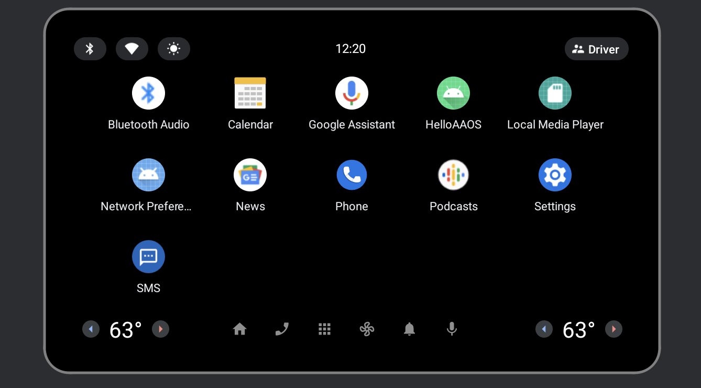
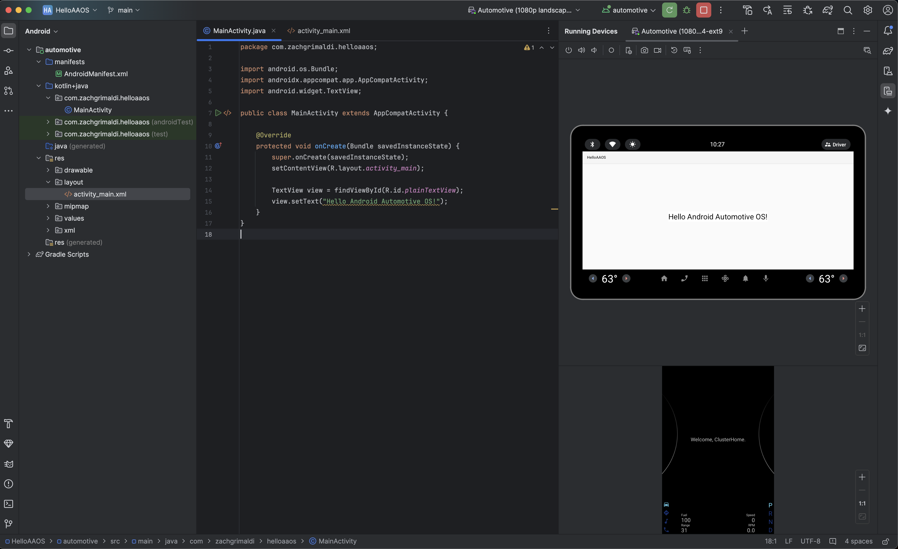

# HelloAAOS

This is an example Android Automotive OS app with included instructions for setting up an Android Automotive OS emulator in Android Studio and running the app on it.

## Tested on Android 14 Virtual Device

## Relevant files

To get better understanding of the changes made to the template app `Automotive > No Activity` in Android Studio, please refer to the following files:

- [`AndroidManifest.xml`](./automotive/src/main/AndroidManifest.xml) - Automotive OS specific manifest entries
- [`automotive_app_desc.xml`](./automotive/src/main/res/xml/automotive_app_desc.xml) - Automotive OS specific app description
- [`MainActivity.java`](./automotive/src/main/java/com/example/helloaaos/MainActivity.java) - Main activity
- [`activity_main.xml`](./automotive/src/main/res/layout/activity_main.xml) - Main activity layout

## Prerequisites

- Android Studio (this was developed with `android-studio-2024.2.1.10-mac`)

## Steps

1. Clone this repository. `git clone https://github.com/zpg6/hello-aaos`

2. Open the project in Android Studio.

3. Create an Android Automotive OS emulator

4. Run the app on the emulator

## Create an Android Automotive OS emulator

### Create a virtual device

### Select the hardware profile

### Configure the system image

### Complete the device setup

### Device created

### First boot

## Run the app on the emulator

### The `HelloAAOS` app will appear in the app drawer:

### Then it will be launched:

### All within Android Studio! :)

